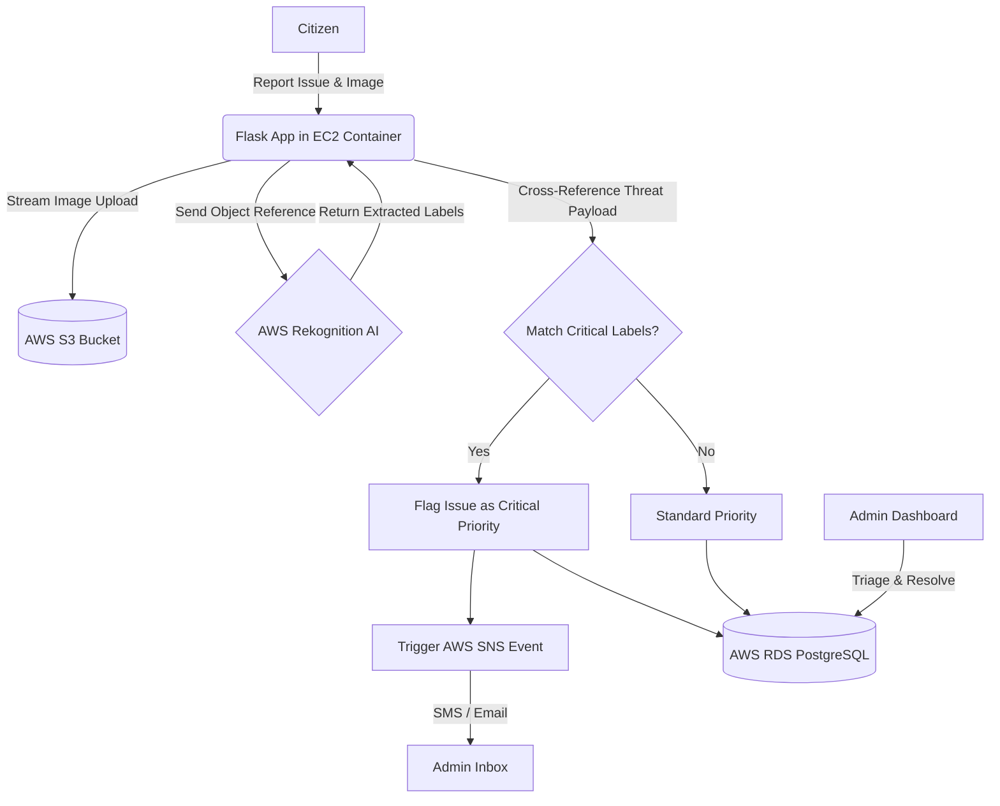

# 🧠 Tech Stack & Architecture: Smart Citizen Reporter

This document breaks down the exact technologies, libraries, and cloud architecture used to build the Smart Citizen Reporter platform. It serves as a comprehensive guide for technical interviews or portfolio reviews.

## 🛠️ Complete Tech Stack & Libraries

### Cloud Infrastructure (AWS)
*   **AWS EC2 (Elastic Compute Cloud)**: The host virtual machine running the Dockerized application.
*   **AWS RDS (Relational Database Service)**: Managed PostgreSQL database ensuring ACID compliance and automated backups.
*   **AWS S3 (Simple Storage Service)**: Secure, highly available object storage used to directly stream and serve user-uploaded issue photography, bypassing local server bottlenecks.
*   **AWS SNS (Simple Notification Service)**: A pub/sub messaging service used to dispatch critical emergency incident alerts (via SMS or Email) to city administrators in real-time.
*   **AWS Rekognition**: Amazon's Computer Vision AI API used for automated image classification.

### Backend Application
*   **Language**: Python 3.10+
*   **Web Framework**: `Flask==3.0.0`
*   **AWS SDK**: `boto3==1.34.0` (The official AWS SDK for Python, used to interface programmatically with S3, SNS, and Rekognition).
*   **Production Server**: `gunicorn==21.2.0` (A Python WSGI HTTP Server for UNIX, providing concurrency and stability).

### Database & ORM
*   **Database Engine**: `psycopg2-binary==2.9.9` (The PostgreSQL database adapter for Python).
*   **Object Relational Mapper**: `Flask-SQLAlchemy==3.1.1` (Abstracts SQL queries into Python objects for secure, injection-resistant data handling).

### Authentication & Utilities
*   **Session Management**: `Flask-Login==0.6.3` (Manages user sessions, remember-me cookies, and RBAC endpoint protection).
*   **Security & Hashing**: `Werkzeug==3.0.1` (For secure password hashing and filename sanitization).
*   **Mail Fallback**: `Flask-Mail==0.9.1` (Provides SMTP email fallbacks if AWS SNS is unavailable).
*   **Environment Strategy**: `python-dotenv==1.0.0` (Injects 12-factor app environment variables from `.env` files).

### Deployment & DevOps
*   **Containerization**: Docker & Docker Compose (`docker-compose.yml` defining the multi-container `web` and `db` network).
*   **Bash / PowerShell**: Automated deployment (`wget`/`curl` pipelines utilizing `apt-get` and `winget`).

---

## 🏗️ The AI & Alert Architecture

The standout feature of this application is its automated triage system using Cloud AI and Pub/Sub mechanics.

### 🌊 AWS Data Flowchart

### 1. Artificial Intelligence Integration
When a citizen uploads a photo of an issue, the image is streamed directly to AWS S3.
*   The application immediately passes the S3 object reference to **AWS Rekognition**.
*   The AI scans the image and returns a list of detected labels and confidence scores.
*   **Threat Detection**: The backend cross-references these labels against an internal threat payload. If the AI detects words like `fire`, `accident`, `flood`, or `collapsed building`, it overwrites the citizen's priority assessment and instantly flags the issue as **CRITICAL**.

### 2. Automated Alerting Pipeline
Administrators cannot be expected to watch the dashboard 24/7. When an issue is flagged as `CRITICAL`:
*   The application leverages `boto3` to trigger an **Amazon SNS** topic.
*   SNS dispatches an immediate **SMS Text Message** or **Email** to the registered city administrators containing the incident location, description, and link, ensuring emergency response times are minimized.
*   *Graceful Degradation*: If the application cannot reach AWS (e.g., when running locally), it does not crash. It automatically falls back to local SQLite databases, local file system storage, and standard SMTP emails, proving high fault-tolerance.
