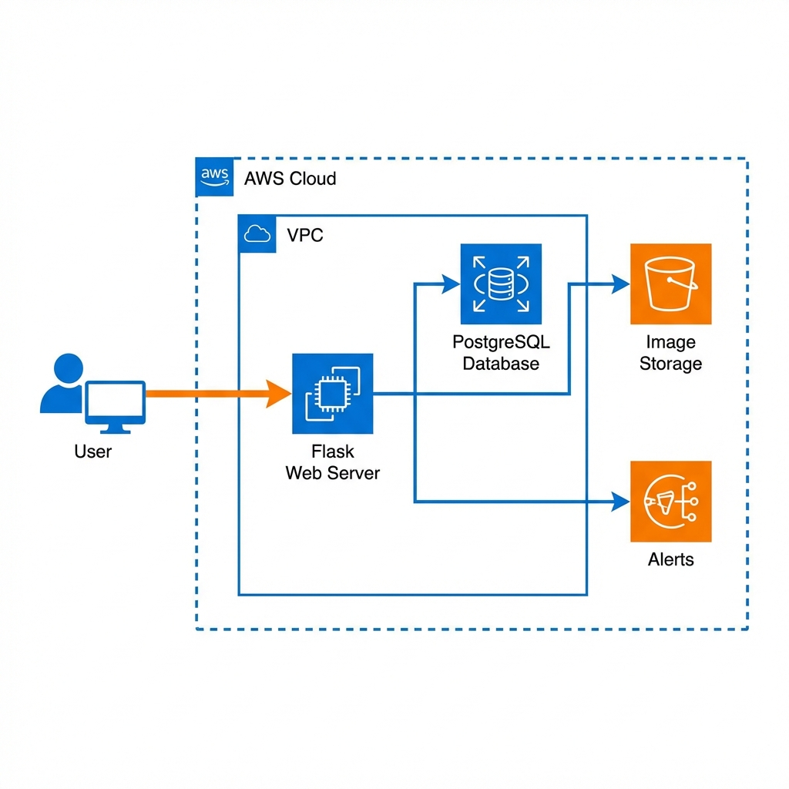
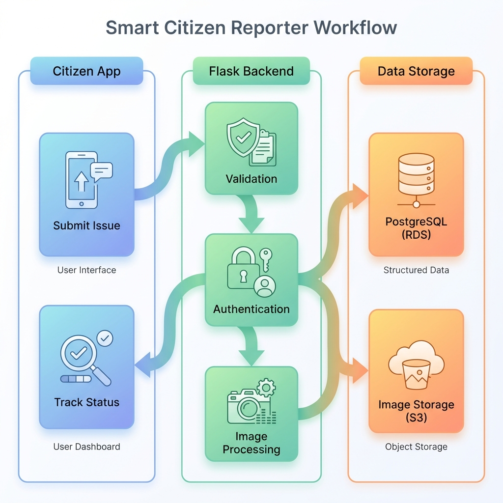

# Project Architecture 🏛️

This document describes the high-level architecture of the **Smart Citizen Reporter** application deployed on AWS.

## System Diagrams

### 1. AWS Cloud Architecture
The infrastructure layout on Amazon Web Services.

### 2. Application Workflow
How the system processes data internally from Citizen to Backend to Storage.

## Component Breakdown

1.  **User (Citizen/Admin)**: Accesses the application via a web browser.
2.  **EC2 Instance (Flask Web Server)**:
    - Hosts the Python Flask application.
    - Handles HTTP requests and serves the frontend (HTML/CSS/JS).
    - Processes business logic for reporting and managing issues.
3.  **RDS Instance (PostgreSQL Database)**:
    - Managed relational database.
    - Stores structured data: Users, Issues, Categories, and Statuses.
4.  **S3 Bucket (Image Storage)**:
    - Highly durable object storage.
    - Stores the photos uploaded by citizens when reporting issues.
5.  **SNS Topic (Alerts)**:
    - Simple Notification Service.
    - Sends email notifications to administrators when high-priority issues are reported.
6.  **VPC (Virtual Private Cloud)**:
    - Provides a private, isolated network environment for the resources.
    - **Internet Gateway**: Allows the EC2 instance to communicate with the internet.
    - **Public Subnets**: Where the EC2 and RDS (publicly accessible) reside.
